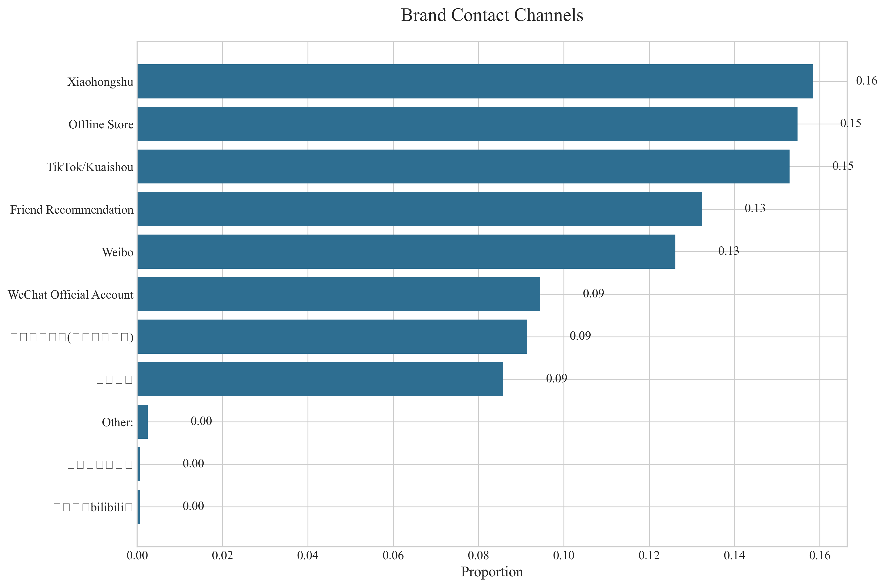
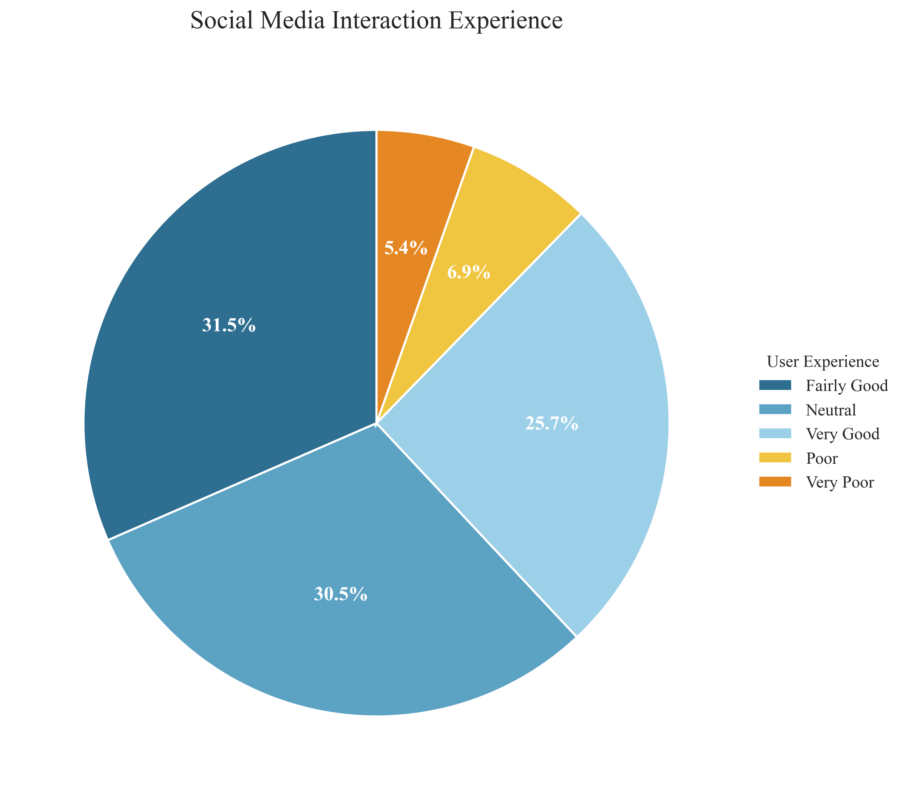
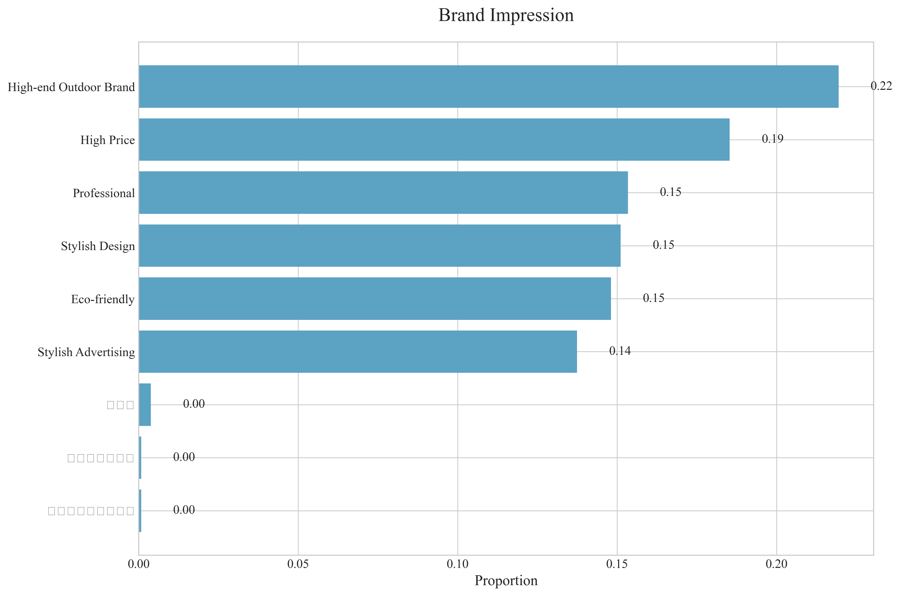
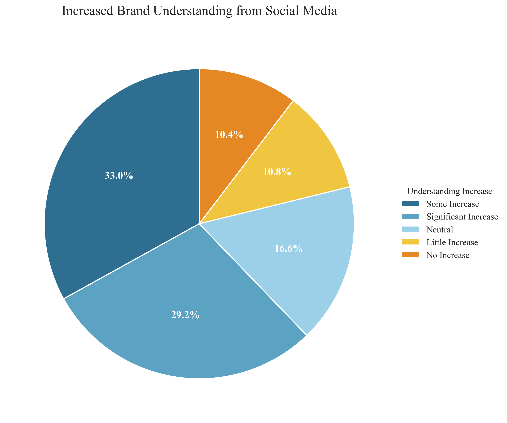
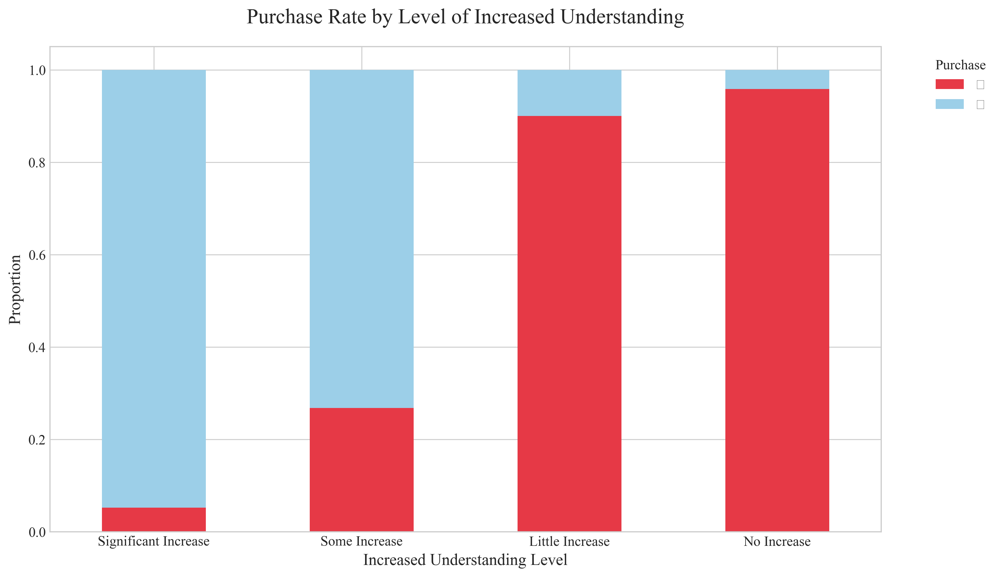
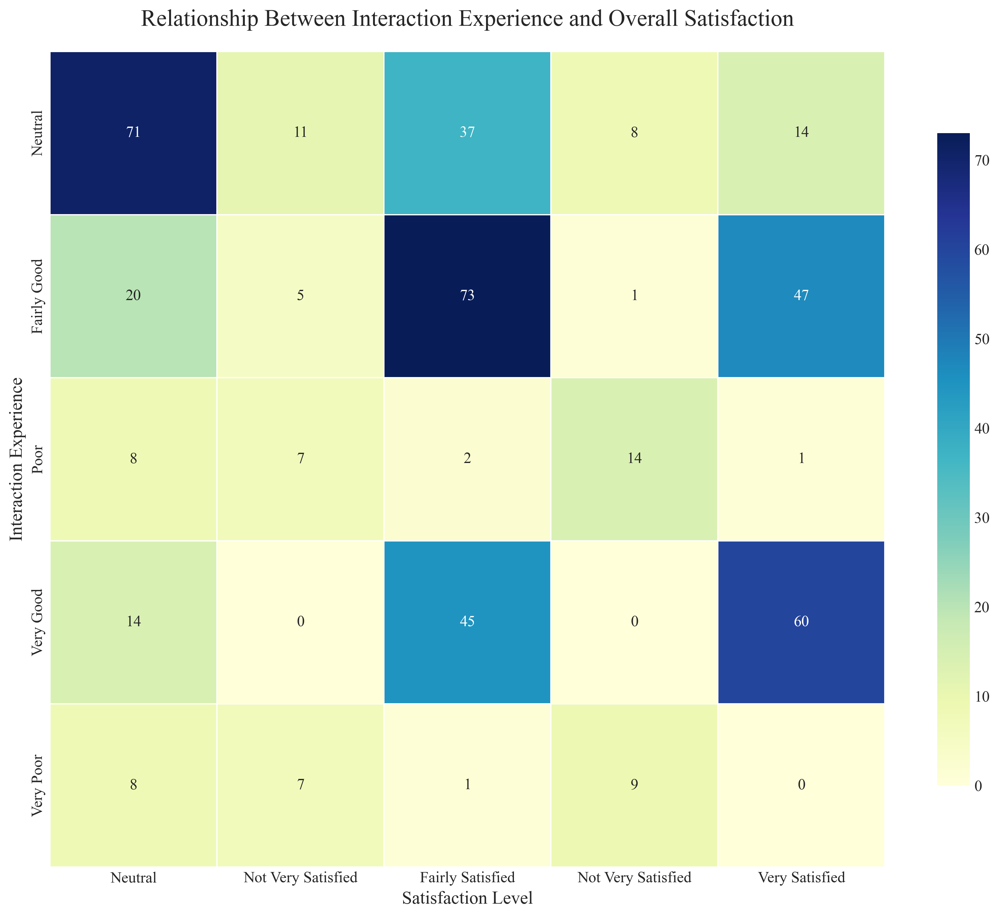

# Supplementary Analysis: Arc'teryx Social Media Marketing

## Additional Insights Beyond the SICAS Framework

This report extends the original SICAS model analysis with additional dimensions that provide deeper insights into Arc'teryx's social media marketing effectiveness.

## 1. Brand Contact Channels

Understanding how consumers first encounter and interact with the Arc'teryx brand provides valuable insights for channel optimization.

The primary channels through which respondents encounter the Arc'teryx brand are Xiaohongshu (15.8%), Offline Store (15.5%), TikTok/Kuaishou (15.3%). **Recommendations:**

- Strengthen presence on the top-performing channels to maximize reach
- Evaluate underperforming channels to determine whether to improve content or reallocate resources
- Develop channel-specific content strategies that leverage the unique features of each platform

## 2. Social Media Interaction Experience

The quality of interaction experience directly impacts user satisfaction and ongoing engagement with the brand.

Analysis shows that 57.2% of respondents report a positive interaction experience, while 30.5% describe it as neutral and 12.3% report a negative experience. The moderate level of positive experiences indicates room for improvement in interaction quality and responsiveness.

**Recommendations:**

- Implement standardized response protocols to ensure consistent quality of interaction
- Reduce response times to user comments and queries
- Train social media managers on effective community engagement techniques

## 3. Brand Impression

Consumer perceptions of the Arc'teryx brand reveal how effectively social media marketing communicates brand values and positioning.

The dominant brand impressions among respondents are High-end Outdoor Brand (21.9%), High Price (18.5%), Professional (15.3%). **Recommendations:**

- Align social media content with desired brand attributes to reinforce brand positioning
- Address potential negative perceptions through targeted content strategies
- Leverage strengths in consumer perception to differentiate from competitors

## 4. Increased Brand Understanding from Social Media

Effective social media should educate consumers and increase their understanding of the brand's offerings and values.

62.2% of respondents report that social media has significantly or somewhat increased their understanding of the Arc'teryx brand, while 21.2% indicate little or no increase in understanding. The moderate educational impact suggests opportunities to enhance informational content in social media strategy.

**Recommendations:**

- Develop more educational content that highlights product features, technologies, and brand values
- Create content series specifically designed to increase brand literacy among consumers
- Implement interactive formats like Q&A sessions to address consumer information needs

## 5. Cross-Dimensional Analysis

### Understanding-to-Purchase Relationship

The relationship between increased brand understanding and purchase behavior reveals how educational content drives conversion.

This visualization demonstrates how increasing levels of brand understanding correlate with higher purchase rates, emphasizing the importance of educational content in the conversion funnel.

### Interaction Experience vs. Satisfaction

The correlation between interaction experience and overall satisfaction highlights the impact of community management on brand perception.

The heatmap reveals a strong correlation between positive interaction experiences and higher overall satisfaction, underlining the importance of quality engagement in social media strategy.

## 6. User Suggestions

The analysis collected 332 unique suggestions from respondents regarding Arc'teryx's social media marketing. Common themes include:

- More product demonstrations and usage scenarios
- Enhanced interactivity and community-building features
- Value-focused content that justifies premium pricing
- Improved mobile experience and accessibility

## Integrated Conclusions

When combined with the SICAS model analysis, these additional dimensions provide a comprehensive view of Arc'teryx's social media marketing effectiveness. Key integrated insights include:

1. **Channel-to-Awareness Pipeline**: The data reveals how different contact channels contribute to varying levels of brand awareness, highlighting the need for channel-specific strategies.

2. **Experience-Satisfaction-Loyalty Relationship**: The strong correlation between interaction experience and satisfaction underscores the importance of community management in building brand loyalty.

3. **Understanding-to-Purchase Conversion**: The clear relationship between increased brand understanding and purchase behavior demonstrates that educational content serves as a critical conversion driver.

4. **Brand Perception Alignment**: Analysis of brand impressions reveals how effectively social media communication aligns with desired brand positioning and highlights areas for refinement.

## Strategic Recommendations

Based on this supplementary analysis, we recommend the following strategic initiatives to enhance Arc'teryx's social media marketing effectiveness:

1. **Integrated Channel Strategy**: Develop a coordinated multi-channel approach that leverages the strengths of each platform while maintaining consistent brand messaging.

2. **Enhanced Community Management**: Implement advanced community management protocols to improve interaction experience, which directly impacts overall satisfaction.

3. **Educational Content Program**: Create structured educational content that systematically increases consumer understanding of brand values, product features, and technologies.

4. **Brand Perception Management**: Develop targeted content strategies to reinforce positive brand impressions while addressing potential negative perceptions.

5. **Conversion Optimization**: Leverage the understanding-to-purchase relationship by creating educational content specifically designed to move consumers through the conversion funnel.

