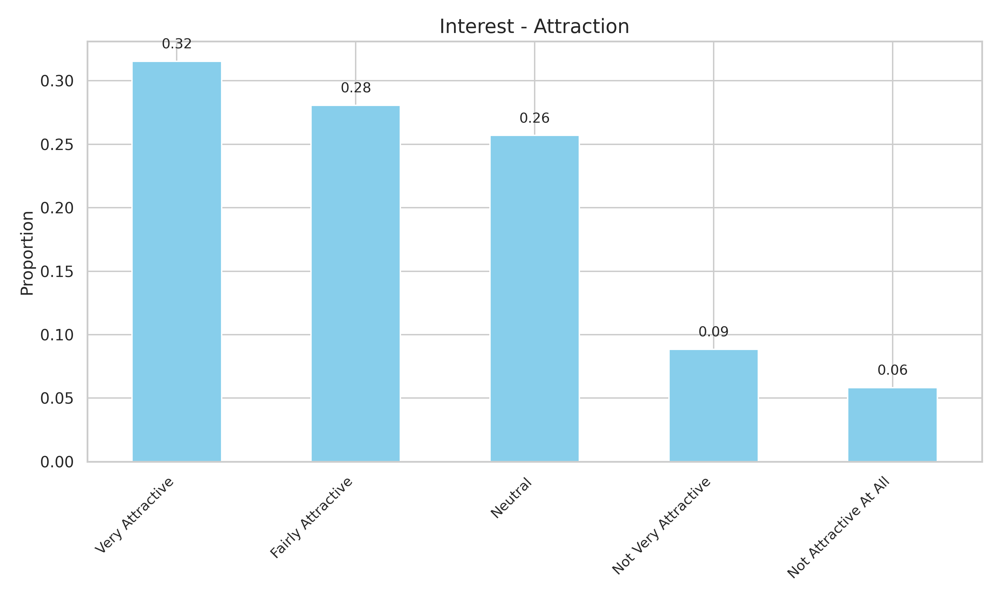
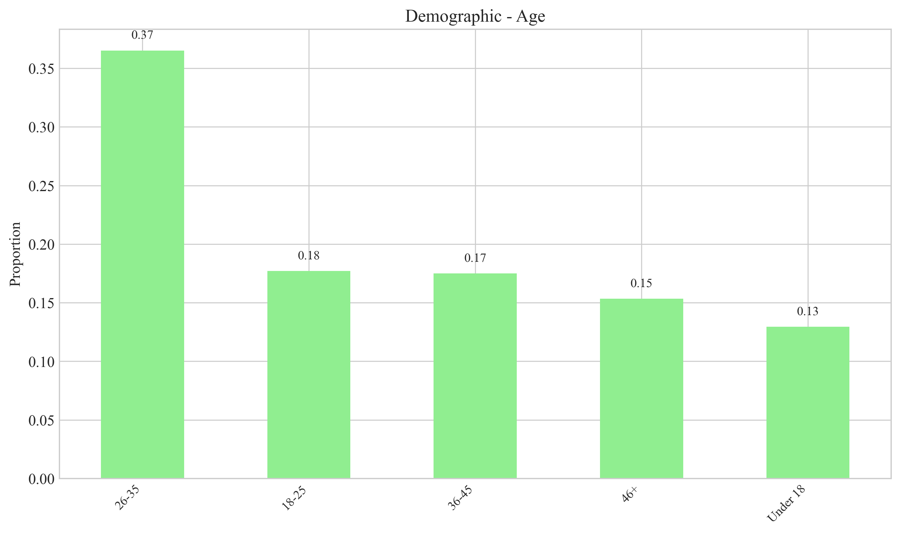

# Arc'teryx (始祖鸟) Social Media Marketing Analysis Report

## SICAS Model Analysis

### Sense

#### Awareness

```
您是否了解始祖鸟（Arc'teryx）品牌？
略有了解     0.444924
非常了解     0.306695
不太了解     0.140389
完全不了解    0.107991
Name: proportion, dtype: float64
```


### Interest

#### Attraction

```
始祖鸟的社交媒体内容对您的吸引力如何?
非常吸引     0.315335
比较吸引     0.280778
一般       0.257019
不太吸引     0.088553
完全不吸引    0.058315
Name: proportion, dtype: float64
```



### Communication

#### Interaction

```
您是否曾与始祖鸟的社交媒体账号互动?
经常互动(点赞、评论、分享等)    0.317495
从未互动               0.282937
偶尔互动               0.269978
很少互动               0.129590
Name: proportion, dtype: float64
```


#### Interaction_types

```
点赞          0.214240
评论          0.190507
观看直播        0.175112
参与话题活动      0.149455
私信交流        0.135343
分享到个人社交圈    0.125080
其他：         0.009622
其他：〖不互动〗    0.000641
Name: proportion, dtype: float64
```


### Action

#### Purchase

```
您是否因社交媒体内容购买过始祖鸟产品？
是    0.600432
否    0.399568
Name: proportion, dtype: float64
```


### Share

#### Satisfaction

```
您对始祖鸟社交媒体的整体满意度如何？
比较满意     0.341253
非常满意     0.263499
一般       0.261339
非常不满意    0.069114
不太满意     0.064795
Name: proportion, dtype: float64
```


#### Improvements

```
内容丰富度        0.227928
与用户互动性       0.208108
信息实用性        0.181081
创意和设计感       0.149550
发布频率         0.125225
客户服务／售后服务    0.099099
其他：          0.007207
其他：〖价格〗      0.000901
其他：〖不熟悉〗     0.000901
Name: proportion, dtype: float64
```


## Demographic Analysis

### Gender

```
您的性别
男    0.537797
女    0.462203
Name: proportion, dtype: float64
```


### Age

```
您的年龄
26-35岁    0.365011
18-25岁    0.177106
36-45岁    0.174946
46岁及以上    0.153348
18岁以下     0.129590
Name: proportion, dtype: float64
```



### Occupation

```
您的职业
企业职员        0.367171
政府机关工作人员    0.250540
学生          0.190065
其他          0.110151
自由职业者       0.082073
Name: proportion, dtype: float64
```


### Social_media_usage

```
您每天使用社交媒体的时长大约是多少？
1-3小时    0.356371
3-5小时    0.345572
5小时以上    0.183585
少于1小时    0.114471
Name: proportion, dtype: float64
```


## SICAS Funnel


## Recommendations

### Improving Brand Awareness

- Consider expanding social media presence on platforms with high user engagement
- Develop targeted content that highlights the unique features of Arc'teryx products
- Collaborate with outdoor influencers and communities to increase brand visibility

### Enhancing Content Interest

- Create more interactive and engaging content formats
- Showcase real customer experiences and testimonials
- Develop educational content about outdoor activities and equipment usage

### Improving User Interaction

- Implement more interactive features in social media posts
- Respond promptly to user comments and messages
- Host live events, Q&A sessions, and contests to encourage participation

### Driving Purchase Decisions

- Address price concerns by highlighting product durability and value
- Provide clear information about product features and benefits
- Create exclusive social media promotions and discounts

### Enhancing User Satisfaction and Sharing

- Encourage users to share their experiences with Arc'teryx products
- Create shareable content formats like challenges and user-generated content campaigns
- Reward and recognize users who engage with and share brand content

