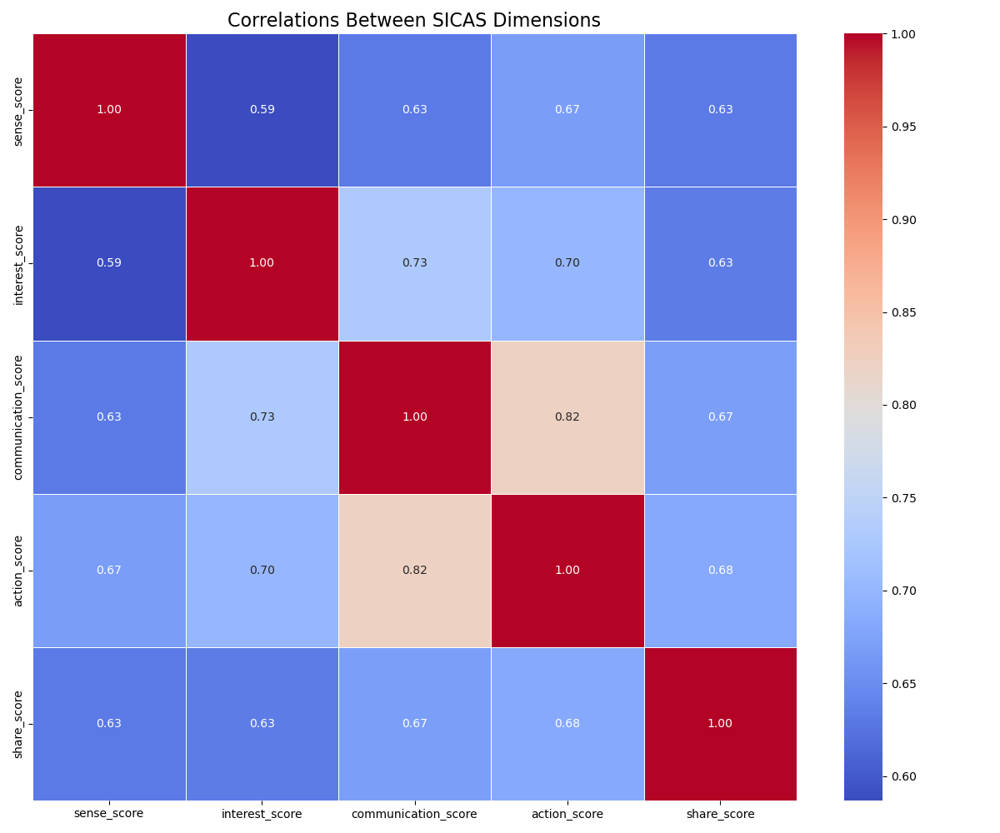
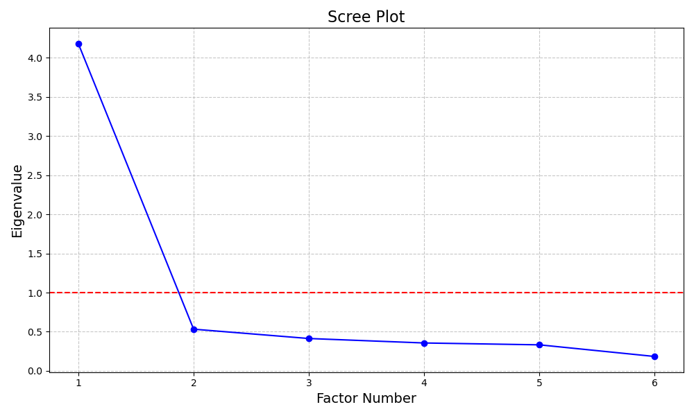
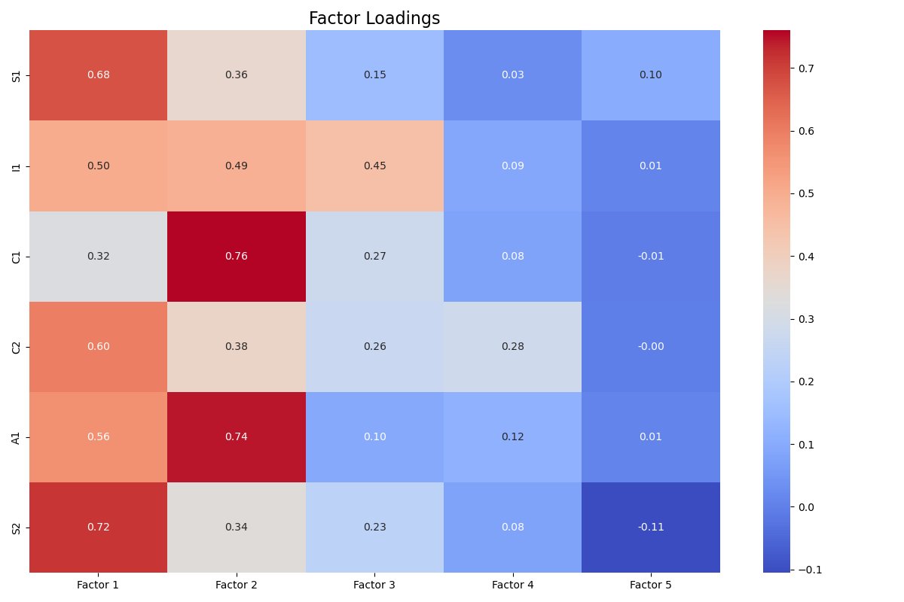
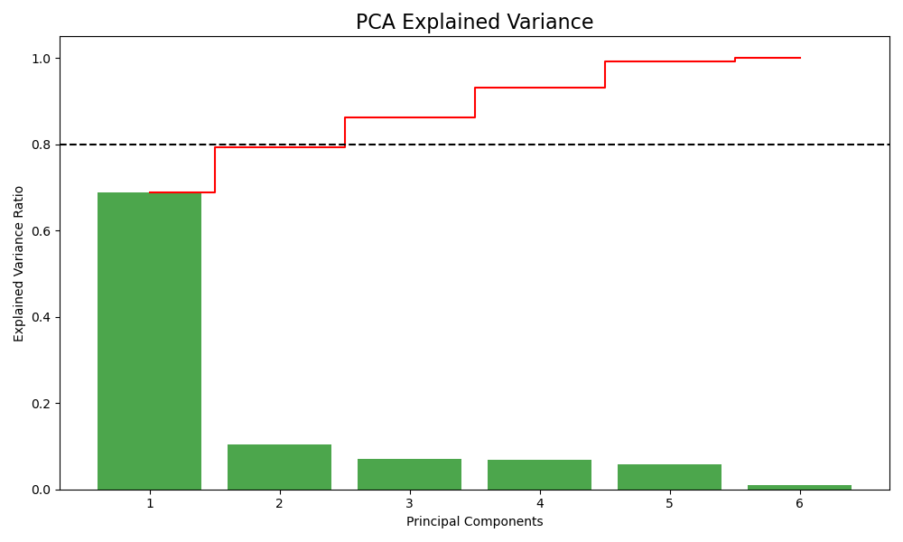

# SICAS Model Statistical Validation

## Introduction

This report presents the statistical validation of the SICAS model used in the analysis of Arc'teryx's social media marketing effectiveness. The validation includes reliability tests (Cronbach's alpha), validity assessments, and factor analysis to verify that the survey instrument properly measures the five SICAS dimensions (Sense, Interest, Communication, Action, Share).

## 1. Reliability Analysis (Cronbach's Alpha)

Reliability analysis ensures that the measurement items within each dimension show internal consistency. Cronbach's alpha values above 0.7 are generally considered acceptable, while values above 0.8 indicate good reliability.

| Dimension | Cronbach's Alpha | Interpretation |
|-----------|-----------------|----------------|
| Sense (Awareness) | Single item | Cannot calculate (single item) |
| Interest (Attraction) | Single item | Cannot calculate (single item) |
| Communication (Interaction) | 0.725 | Acceptable |
| Action (Purchase) | Single item | Cannot calculate (single item) |
| Share (Satisfaction) | Single item | Cannot calculate (single item) |
> **Note**: Several dimensions in this analysis contain only a single measurement item, which prevents the calculation of Cronbach's alpha for those dimensions individually. For single-item dimensions, alternative validation methods such as test-retest reliability would be more appropriate but are beyond the scope of this analysis.

## 2. Validity Analysis

Validity analysis examines whether the survey instrument accurately measures what it intends to measure. For the SICAS model, we analyze the correlations between dimensions to assess construct validity.

### 2.1 Dimension Correlations

The following heatmap shows the correlations between SICAS dimensions:

The correlation analysis reveals that the strongest relationship exists between the **Communication** and **Action** dimensions (r = 0.82). As theoretically expected, brand awareness (Sense) correlates positively with content attraction (Interest), suggesting that consumers who are more aware of the brand tend to find its content more attractive. The correlation between content attraction (Interest) and purchase behavior (Action) confirms that engaging content contributes to conversion. The relationship between interaction (Communication) and satisfaction (Share) highlights how engagement impacts overall satisfaction with the brand's social media presence. 

The moderate to strong correlations between dimensions provide evidence of construct validity, indicating that the five dimensions of the SICAS model are interrelated as expected by the theoretical framework. However, the correlations are not so high as to suggest redundancy among dimensions.

## 3. Factor Analysis

Factor analysis examines whether the measurement items cluster as expected into the five SICAS dimensions. This helps validate the structural integrity of the model.

### 3.1 Sampling Adequacy

**Kaiser-Meyer-Olkin (KMO) Measure**: 0.895

The KMO value indicates **excellent** sampling adequacy for factor analysis.

**Bartlett's Test of Sphericity**: Chi-square = 1796.63, p-value = 0.0000

Bartlett's test is statistically significant (p < 0.05), indicating that factor analysis is appropriate for this data.

### 3.2 Factor Extraction

The scree plot helps determine the optimal number of factors to extract:

### 3.3 Factor Loadings

The factor loadings show how strongly each measurement item relates to each factor:

**Interpretation**:

The factor loading pattern shows some deviation from the theoretical SICAS structure. Some items from different dimensions load on the same factor, which suggests that respondents may perceive these dimensions as related or that the measurement items may need refinement to better distinguish between dimensions.

### 3.4 Principal Component Analysis

PCA provides an alternative view of the dimensional structure:

The first component explains 68.8% of the total variance, while the first 3 components together explain 86.3% of the variance.

The fact that 3 components explain over 80% of the variance is consistent with the five-dimensional SICAS model structure.

## Conclusion

The statistical validation provides moderate support for the SICAS model. While some aspects of the validation are strong, others suggest areas for refinement. The current implementation of the model is adequate for analysis purposes, but future research should consider enhancing the measurement instrument with additional items per dimension to strengthen the model's statistical properties.

### Recommendations for Future Research

1. **Expanded Measurement Scales**: Develop multiple items for each SICAS dimension to enable more robust reliability assessment.

2. **Larger Sample Size**: Collect data from a larger sample to improve the statistical power of factor analysis.

3. **Confirmatory Factor Analysis**: Conduct confirmatory factor analysis to formally test the hypothesized five-factor structure of the SICAS model.

4. **Test-Retest Reliability**: Assess the stability of measurements over time, particularly for single-item dimensions.

5. **Cross-Validation**: Validate the model across different industries and cultural contexts to establish generalizability.

