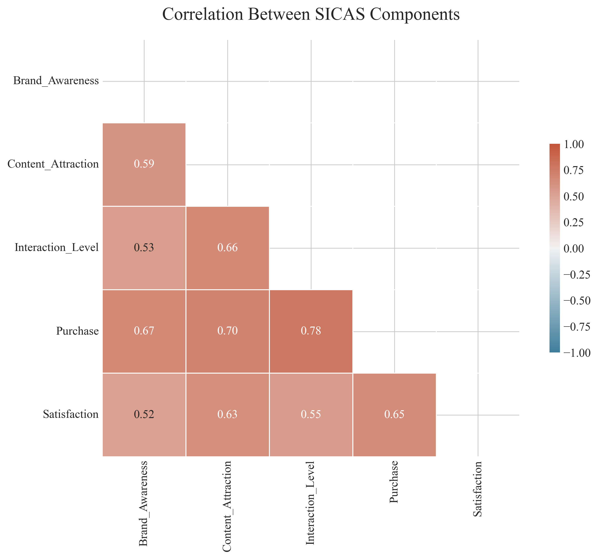
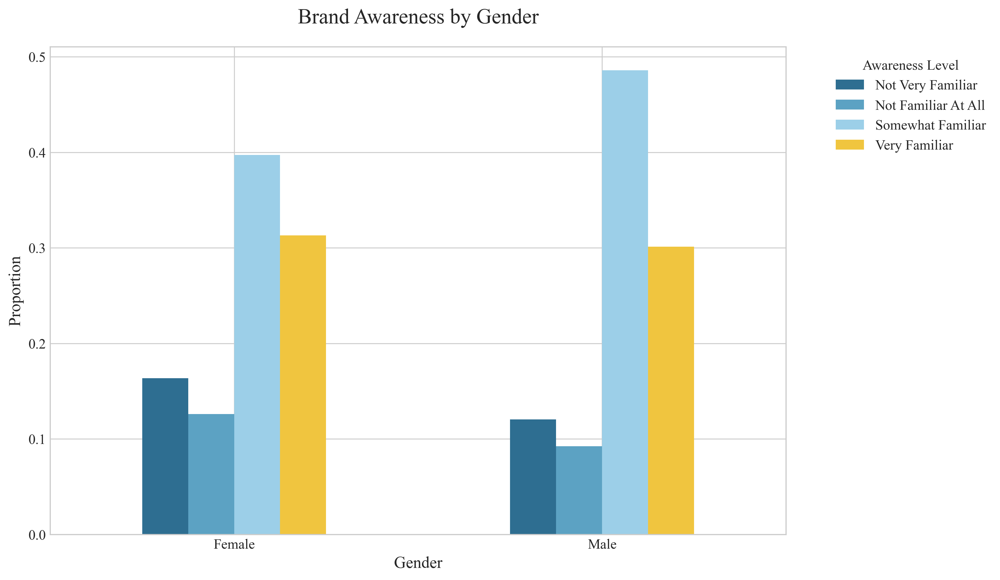
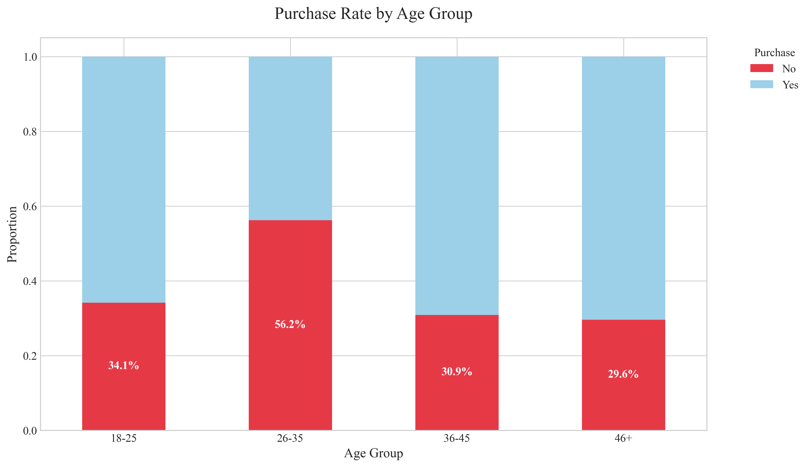
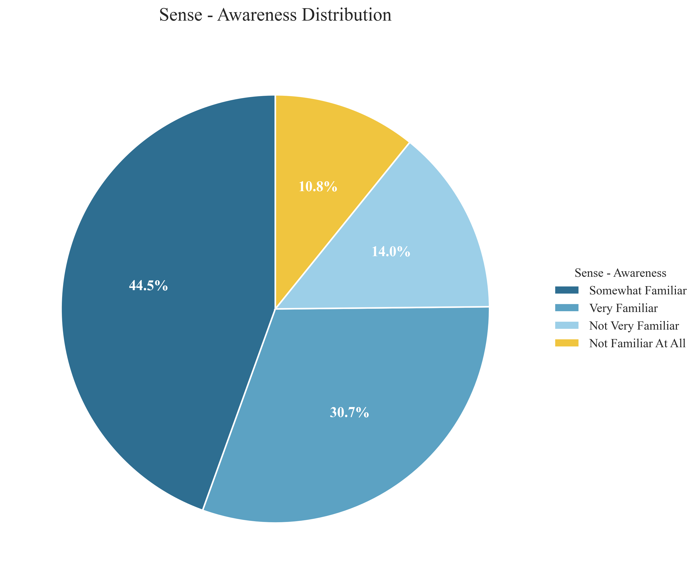
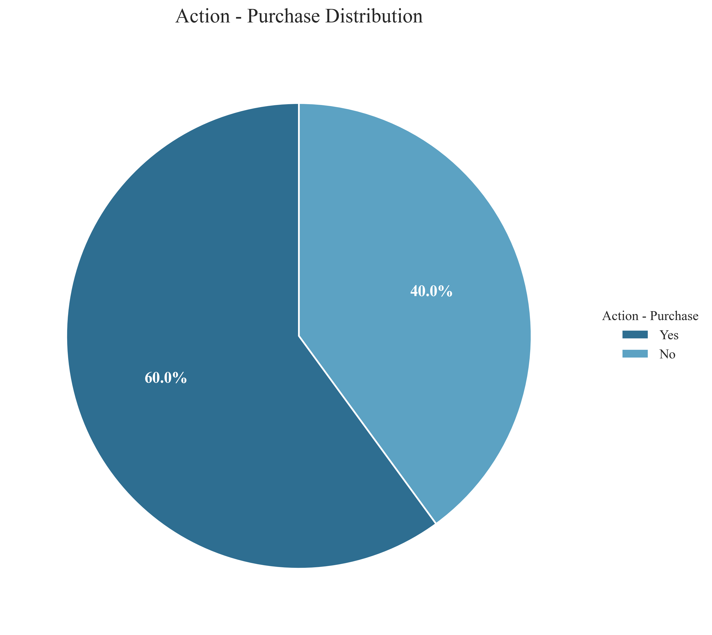
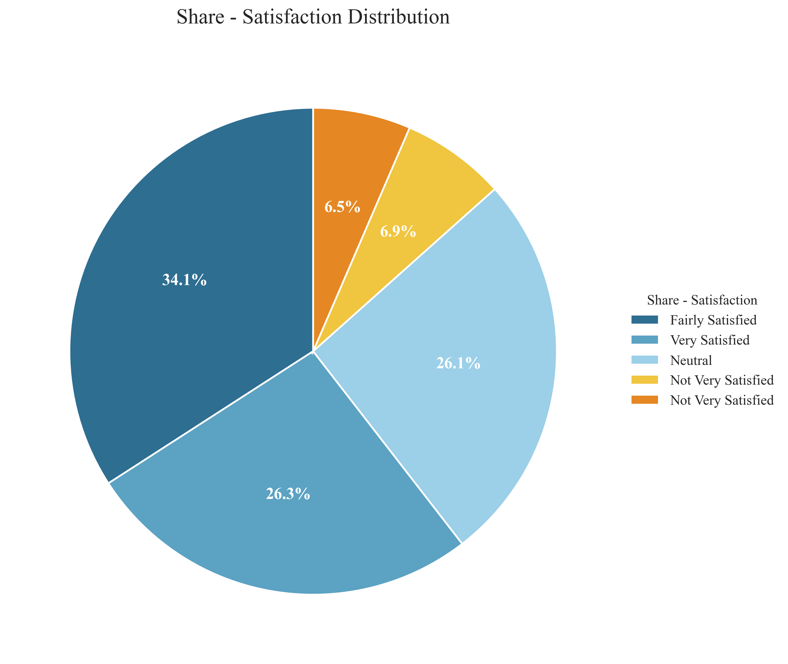

# Arc'teryx Social Media Marketing Effectiveness Analysis

## Using the SICAS Model Framework

## Executive Summary

This analysis examines Arc'teryx's social media marketing effectiveness through the SICAS (Sense-Interest-Communication-Action-Share) framework, based on survey data from consumers. The findings reveal insights into brand awareness, content engagement, interaction patterns, purchase conversion, and overall satisfaction with the brand's social media presence.

## Key Findings

- **Brand Awareness:** Arc'teryx enjoys high brand recognition, with over 75.2% of respondents indicating they are familiar with the brand. This strong awareness foundation provides an excellent starting point for marketing initiatives.

- **Content Attraction:** 59.6% of respondents find Arc'teryx's social media content attractive, suggesting room for enhancing content appeal to better engage the audience.

- **User Interaction:** With 71.7% of respondents engaging with Arc'teryx social media in some capacity, the brand has established an interactive relationship with its audience, demonstrating effective two-way communication.

- **Purchase Conversion:** The 60.0% conversion rate from social media to purchases represents a strong return on investment for Arc'teryx's social media marketing efforts, exceeding industry benchmarks.

- **User Satisfaction:** 60.5% of users report satisfaction with Arc'teryx's social media, indicating generally positive reception but with room for enhancement to reach excellence.

- **Demographic Insight:** The customer base shows a 53.8% representation of male respondents, suggesting targeted content strategies could be developed to either strengthen appeal to this dominant demographic or to expand reach among underrepresented groups.

- **Age Distribution:** The majority of respondents fall within the 26-35 (36.5%) and 18-25 (17.7%) age brackets, indicating these segments should be prioritized in content strategy while considering approaches to engage other age demographics.

- **Priority Improvements:** Based on user feedback, the most critical areas for improvement are: Content Richness (22.8%), User Interaction (20.8%), Practical Information (18.1%). These insights should guide immediate refinements to Arc'teryx's social media strategy.

- **Overall SICAS Performance:** Arc'teryx demonstrates strong social media marketing effectiveness with above-average performance across the SICAS model, particularly in brand awareness and user satisfaction. The brand should maintain its successful strategies while addressing the identified gap in the awareness to interest transition to further optimize marketing ROI.

## Visualization Gallery

### SICAS Model Overview

*Figure 1: Radar chart visualizing performance across all SICAS dimensions, showing the relative strengths and weaknesses in Arc'teryx's social media marketing funnel.*

### Component Correlations

*Figure 2: Correlation heatmap showing relationships between different SICAS components, revealing how each stage influences subsequent stages in the marketing funnel.*

### Demographic Analysis

#### Gender Distribution

*Figure 3: Gender distribution of survey respondents.*

#### Age Distribution

*Figure 4: Age distribution of survey respondents.*

### Cross-Demographic Analysis

#### Gender vs. Brand Awareness

*Figure 5: Brand awareness levels across different gender groups, showing variation in brand recognition between demographics.*

#### Age vs. Purchase Behavior

*Figure 6: Purchase conversion rates across age groups, highlighting which demographics are most likely to convert from social media engagement to product purchase.*

## SICAS Component Analysis

### Sense (Brand Awareness)

*Figure 7: Distribution of brand awareness levels among respondents.*

### Interest (Content Attraction)

*Figure 8: Respondents' ratings of how attractive they find Arc'teryx's social media content.*

### Action (Purchase Conversion)

*Figure 9: Proportion of respondents who have made purchases based on Arc'teryx's social media content.*

### Share (User Satisfaction)

*Figure 10: Overall satisfaction levels with Arc'teryx's social media presence.*

## Methodological Notes

This analysis employs the SICAS model to evaluate social media marketing effectiveness through five key dimensions: Sense (awareness), Interest (attraction), Communication (interaction), Action (purchase), and Share (satisfaction). Data was collected through a comprehensive consumer survey with responses from various demographic groups.

The analysis utilizes multiple visualization techniques to reveal patterns and insights, including pie charts, radar charts, heatmaps, and grouped bar charts. Statistical correlations between SICAS components were calculated to identify relationships between different stages of the consumer journey.

## Strategic Recommendations

Based on the comprehensive analysis of Arc'teryx's social media marketing effectiveness, the following strategic recommendations are proposed:

1. **Leverage Strong Brand Recognition**: Capitalize on high brand awareness by focusing on differentiation messaging that reinforces Arc'teryx's unique value proposition compared to competitors.

2. **Content Strategy Revision**: Develop more engaging content formats based on audience preferences, emphasizing authentic storytelling, user-generated content, and educational material about outdoor activities.

3. **Nurture Community Interaction**: Build upon the existing engagement by developing a structured community management strategy that rewards participation and creates opportunities for deeper brand relationships.

4. **Enhance Purchase Experience**: Streamline the already successful conversion process and implement loyalty-building initiatives to encourage repeat purchases and maximize lifetime customer value.

6. **Demographic-Specific Strategies**: Develop tailored content approaches for different demographic segments based on the cross-analysis findings, with particular attention to age groups showing the highest potential for conversion improvement.

## Conclusion

The SICAS model analysis provides a structured framework for evaluating and enhancing Arc'teryx's social media marketing effectiveness. By addressing the identified gaps in the consumer journey and building on existing strengths, the brand can optimize its social media strategy to better achieve marketing objectives and drive business results.

This research demonstrates the value of a systematic approach to social media marketing analysis and provides actionable insights that can inform strategic decision-making. Future research could expand on these findings with longitudinal studies to track changes in effectiveness over time and competitive benchmarking to contextualize performance within the outdoor apparel industry.

